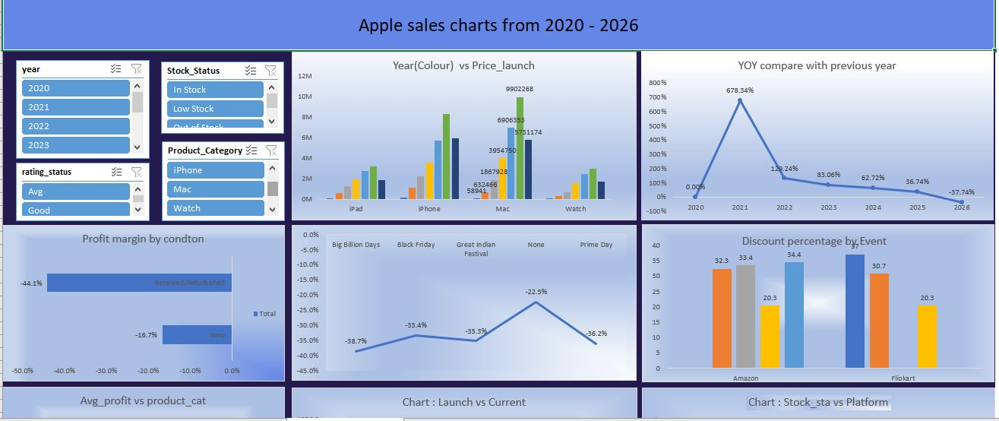

# 🧾 Apple Sales Analysis (2020–2026)

Analyzing Apple product pricing, profitability, and sales trends using PostgreSQL, Excel, and dashboards.

## 📚 Table of Contents
- [Overview](#overview)
- [Business Problem](#business-problem)
- [Tools & Technologies](#tools--technologies)
- [Project Structure](#project-structure)
- [Data Cleaning & Preparation](#data-cleaning--preparation)
- [Exploratory Data Analysis (EDA)](#exploratory-data-analysis-eda)
- [Key Findings](#key-findings)
- [Dashboard](#dashboard)
- [How to Run This Project](#how-to-run-this-project)
- [Final Recommendations](#final-recommendations)
- [Author & Contact](#author--contact)

## Overview

This project evaluates Apple product pricing and sales dynamics to uncover insights into profitability, discounts, and event-driven sales.  
A complete workflow was built using PostgreSQL for ETL, Excel for dashboards, and visualization screenshots for quick previews.

## Business Problem
**Retailers and analysts need to understand**:
- How Apple product prices evolve over time
- Impact of discounts and events on profitability
- YOY growth trends across categories.

## Tools & Technologies

- PostgreSQL (pgAdmin) → ETL, queries
- Excel → PivotTables, charts, dashboard
- Power BI (optional) → visualization
- GitHub → project hosting

## Project Structure

sql-excel-data-analysis/
│
├── README.md                     # Project documentation
├── .gitignore                     # Git ignore rules
│
├── data/                          # Raw and cleaned datasets
│   └── raw_data.csv
│
├── dashboard/                     # Excel dashboard files
│   └── apple_products_pricing_2020_2026.xlsx
│
├── image/                         # Screenshots and visuals
│   └── excel_dashboard.JPG
│
├── scripts/                       # SQL scripts for analysis
│   ├── analysis_query.sql
│   ├── create_table.sql
│   ├── import_and_alter.sql
│   └── project_of_sql.sql

## Data Cleaning & Preparation

- Standardized product categories
- Converted currency formats
- Added profit and margin columns
- Imported CSV into PostgreSQL using `COPY`

## Exploratory Data Analysis (EDA)

- YOY growth in sales
- Profit margin by product condition
- Event-based discount analysis

## Key Findings

- Discounts during events increased sales but reduced margins
- Certain categories (e.g., iPhones) showed consistent YOY growth
- Profitability varied significantly by condition (new vs refurbished)

## Dashboard

## How to Run This Project

1. Import raw CSV into **PostgreSQL**.
2. Run `create_tables.sql` and `import_and_alter.sql`.
3. Execute analysis queries (`analysis_queries.sql`).
4. Open `dashboard/apple_sales_dashboard.xlsx` for interactive charts.

## Final Recommendations

- Optimize discount strategies to balance sales volume and margins.
- Focus on categories with consistent YOY growth.
- Use dashboards for real-time monitoring.

## Author & Contact
**Lalit Kumar**  
Aspiring Data Analyst | AI & Data Science Graduate  
📍 New Delhi, India  
📧 [lkk11002003@gmail.com]
🔗 [LinkedIn Profile](https://www.linkedin.com/in/lalit-kumar-d05-ds/)